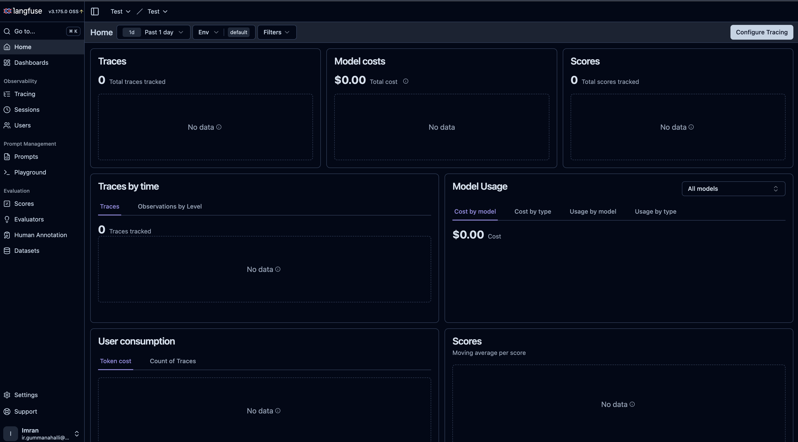
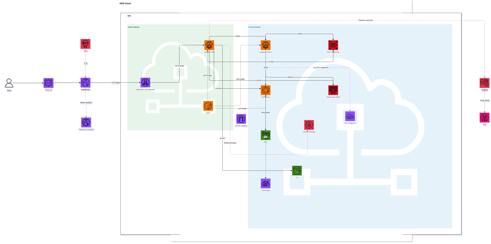

# Langfuse on AWS ECS Fargate — Terraform

[](https://github.com/imran-KG/langfuse-ecs-fargate-terraform/actions/workflows/ci.yml)
[](LICENSE)

Deploy [Langfuse v3](https://langfuse.com) (LLM observability platform) on AWS ECS Fargate using Terraform. No Kubernetes required.

## Dashboard



## Architecture



**No NAT Gateway** — Web tasks run in a public subnet (required for direct Cognito token endpoint access). Worker, ClickHouse, RDS, and Redis run in private subnets. AWS services are reached via VPC endpoints (ECR, S3, CloudWatch, Secrets Manager, Cognito IDP).

## Resources Created by Terraform

| Resource | Details |
|---|---|
| VPC | Public + private subnets across 2 AZs (auto-created) |
| ECR | 3 repositories: `langfuse/web`, `langfuse/worker`, `langfuse/clickhouse` |
| ECS Cluster | Fargate, ARM64 (Graviton) |
| Langfuse Web | 1 task, port 3000, public subnet, behind ALB |
| Langfuse Worker | 1+ tasks, port 3030, private subnet |
| ClickHouse | 1 task, ports 8123/9000, private subnet |
| RDS PostgreSQL | v16, `db.t4g.micro`, private subnet |
| ElastiCache Redis | v7.1, `cache.t4g.micro`, private subnet |
| EFS | Persistent storage for ClickHouse data |
| S3 | Blob storage for Langfuse |
| ALB | HTTP (3000), accepts traffic from CloudFront only |
| CloudFront | Custom domain HTTPS + CloudFront Function for Basic Auth |
| Cognito | User Pool + Hosted UI + App Client, email via SES |
| Secrets Manager | Auto-generated secrets (DB, NextAuth, salt, encryption key, ClickHouse, Cognito client secret) |
| VPC Endpoints | ECR, S3, CloudWatch Logs, Secrets Manager, Cognito IDP |
| Cloud Map | Internal DNS: `clickhouse.langfuse.local` |
| IAM | ECS task execution role + task role (ECS Exec enabled) |

## Prerequisites

- [Terraform](https://developer.hashicorp.com/terraform/install) >= 1.0
- [AWS CLI](https://aws.amazon.com/cli/) configured (`aws configure`)
- [Docker](https://www.docker.com/) installed and running

## Quick Start

### 1. Create your tfvars file

```bash
cp tfvars/example.tfvars tfvars/dev.tfvars
```

Edit `tfvars/dev.tfvars` — only 2 fields are required:

```hcl
aws_profile   = "your-aws-profile"   # AWS CLI profile name
user          = "your-name"          # Tag for resource identification
allowed_cidrs = ["your-ip/32"]       # Your IP — check with: curl https://checkip.amazonaws.com
```

### 2. Deploy

```bash
./deploy.sh tfvars/dev.tfvars your-aws-profile
```

This script runs 4 steps:
1. `terraform init`
2. Create ECR repositories (`terraform apply -target`)
3. Push Langfuse and ClickHouse images from Docker Hub to ECR
4. Deploy all remaining AWS infrastructure and print the URL

### 3. Open Langfuse

```
https://<cloudfront-domain>   # if CloudFront is configured
http://<alb-dns-name>         # direct ALB access
```

> After image push, allow ~2–3 minutes for ECS tasks to start.

## Variables

### Required

| Variable | Description |
|---|---|
| `user` | Your name — used as a resource tag |
| `allowed_cidrs` | IP ranges allowed to access Langfuse (e.g., `["203.0.113.1/32"]`) |

### Commonly Used Options

| Variable | Default | Description |
|---|---|---|
| `aws_region` | `ap-northeast-1` | Deployment region |
| `aws_profile` | `""` | AWS CLI profile (empty = use default) |
| `service_name` | `langfuse` | Prefix for all resource names (also used for Cognito domain) |
| `vpc_cidr` | `10.0.0.0/16` | CIDR for auto-created VPC |
| `vpc_id` | `null` | Use an existing VPC (null = auto-create) |
| `public_subnet_ids` | `null` | Required when using existing VPC |
| `private_subnet_ids` | `null` | Required when using existing VPC |
| `exclude_az_ids` | `["use1-az3"]` | AZs to exclude (ARM64 Fargate not supported in all AZs) |
| `langfuse_web_image_tag` | `3` | Langfuse Web image tag |
| `langfuse_worker_image_tag` | `3` | Langfuse Worker image tag |
| `clickhouse_image_tag` | `24` | ClickHouse image tag |
| `db_instance_class` | `db.t4g.micro` | RDS instance type |
| `db_name` | `langfuse` | Database name |
| `db_multi_az` | `false` | Enable RDS Multi-AZ |
| `cache_node_type` | `cache.t4g.micro` | ElastiCache node type |
| `web_cpu` | `1024` | Web task CPU (1024 = 1 vCPU) |
| `web_memory` | `2048` | Web task memory (MB) |
| `worker_desired_count` | `1` | Number of Worker tasks |
| `worker_cpu` | `1024` | Worker task CPU |
| `worker_memory` | `2048` | Worker task memory (MB) |
| `clickhouse_cpu` | `2048` | ClickHouse task CPU |
| `clickhouse_memory` | `4096` | ClickHouse task memory (MB) |
| `enable_alb` | `true` | Enable Application Load Balancer |
| `nextauth_url` | `""` | Langfuse public URL (e.g., `https://langfuse.example.com`) — auto-derived from ALB DNS if left empty |

### Auth and Email

| Variable | Default | Description |
|---|---|---|
| `auth_disable_signup` | `false` | Disable self-registration via Langfuse UI (Cognito SSO still works) |
| `auth_disable_username_password` | `false` | Disable password login; Cognito SSO only |
| `email_from_address` | `""` | From address for Langfuse + Cognito emails (must be SES-verified) |
| `ses_identity_arn` | `""` | SES verified identity ARN for Cognito email sending |
| `smtp_connection_url` | `""` | SMTP URL for Langfuse Worker email sending |

### CloudFront

| Variable | Default | Description |
|---|---|---|
| `cloudfront_domain` | `""` | Custom domain (e.g., `langfuse.example.com`) |
| `cloudfront_certificate_arn` | `""` | ACM certificate ARN in `us-east-1` (required for CloudFront HTTPS) |
| `cloudfront_zone_id` | `""` | Route53 hosted zone ID for the custom domain |
| `basic_auth_username` | `"admin"` | CloudFront Basic Auth username |
| `basic_auth_password` | `""` | CloudFront Basic Auth password |

## Outputs

After `terraform apply`, these values are printed:

| Output | Description |
|---|---|
| `langfuse_url` | Langfuse ALB URL (HTTP) |
| `cloudfront_url` | Langfuse CloudFront URL (HTTPS + Basic Auth) |
| `cloudfront_distribution_id` | CloudFront distribution ID |
| `cognito_user_pool_id` | Cognito User Pool ID (needed to create users) |
| `cognito_hosted_ui_url` | Cognito Hosted UI base URL |
| `alb_dns_name` | ALB DNS name |
| `ecr_web_url` | ECR URL for Langfuse Web |
| `ecr_worker_url` | ECR URL for Langfuse Worker |
| `ecr_clickhouse_url` | ECR URL for ClickHouse |
| `vpc_id` | VPC ID |
| `public_subnet_ids` | Public subnet IDs |
| `private_subnet_ids` | Private subnet IDs |
| `ecs_cluster_name` | ECS cluster name |
| `rds_endpoint` | RDS PostgreSQL endpoint |
| `redis_endpoint` | ElastiCache Redis endpoint |
| `s3_bucket_name` | S3 bucket name |
| `clickhouse_dns` | ClickHouse internal DNS (`clickhouse.langfuse.local`) |

## HTTPS

HTTPS is enabled by default. Two options:

**Self-signed certificate (default)** — Terraform auto-generates and uploads a certificate to ACM. Your browser will show a security warning; click "Advanced → Continue". Good for dev/internal use.

**ACM certificate (production)** — Provide your own certificate for trusted HTTPS:

```hcl
# tfvars/dev.tfvars
cloudfront_domain          = "langfuse.example.com"
cloudfront_certificate_arn = "arn:aws:acm:us-east-1:123456789012:certificate/xxxx"
cloudfront_zone_id         = "Z1234567890ABC"
nextauth_url               = "https://langfuse.example.com"
```

## AWS Cognito SSO

Authentication uses OAuth2 Authorization Code Flow via Cognito Hosted UI. Password login is disabled by default (`AUTH_DISABLE_USERNAME_PASSWORD=true`).

### Login Flow

```
1. User visits https://<cloudfront-domain>
2. CloudFront Basic Auth (internal access control)
3. Langfuse redirects to Cognito Hosted UI
4. User logs in via Cognito
5. Cognito redirects back to Langfuse
6. NextAuth creates a session
```

### Creating Users

Cognito is configured with `allow_admin_create_user_only = true` — users are **invite-only** (no self-registration).

```bash
# Get User Pool ID after terraform apply
terraform output cognito_user_pool_id

# Invite a user (Cognito sends an invitation email via SES)
aws cognito-idp admin-create-user \
  --user-pool-id <user_pool_id> \
  --username user@example.com \
  --user-attributes \
      Name=email,Value=user@example.com \
      Name=email_verified,Value=true \
  --profile <aws_profile> \
  --region ap-northeast-1
```

The user logs in with the temporary password from the invitation email and sets a new password. They are then redirected to Langfuse.

### Role Management

Cognito handles **authentication** (who you are). **Authorization** (what you can do) is managed in Langfuse.

- A Langfuse account is auto-created on first login
- Organizations and projects are created via the Langfuse UI
- Roles (Owner / Member / Viewer) are assigned by org admins in the Langfuse UI

### Auto-computed Cognito Values

These are computed automatically by Terraform — no need to set them in tfvars:

| Field | Value |
|---|---|
| Cognito domain | `{service_name}.auth.{region}.amazoncognito.com` |
| Hosted UI | `https://{service_name}.auth.{region}.amazoncognito.com` |
| Callback URL | `{nextauth_url}/api/auth/callback/cognito` |
| Issuer | `https://cognito-idp.{region}.amazonaws.com/{user_pool_id}` |

## Security Groups

| Security Group | Inbound | Source |
|---|---|---|
| `langfuse-alb` | 80 | CloudFront managed prefix list |
| `langfuse-web` | 3000 | ALB SG |
| `langfuse-worker` | 3030 | Web SG |
| `langfuse-clickhouse` | 8123, 9000 | Web + Worker SG |
| `langfuse-rds` | 5432 | Web + Worker SG |
| `langfuse-efs` | 2049 (NFS) | ClickHouse SG |

> Web tasks run in a public subnet but inbound access is restricted to the ALB SG only — no direct external access.

## Image Management

ECR repositories are created by Terraform. Images are pushed by `infra/modules/ecr/push-images.sh`, called automatically by `deploy.sh`.

To push images manually:

```bash
./infra/modules/ecr/push-images.sh <aws_account_id> ap-northeast-1
```

To upgrade Langfuse, update the image tags in your tfvars and redeploy:

```hcl
langfuse_web_image_tag    = "3.2.0"
langfuse_worker_image_tag = "3.2.0"
```

```bash
./deploy.sh tfvars/dev.tfvars your-aws-profile
```

## Adding Environment Variables to Langfuse

To add a new environment variable to ECS tasks, edit these 5 files:

| # | File | Role |
|---|---|---|
| 1 | `infra/modules/langfuse/main.tf` | Add env var to ECS task definition |
| 2 | `infra/modules/langfuse/variables.tf` | Declare variable in module |
| 3 | `infra/variables.tf` | Declare variable at root level |
| 4 | `infra/main.tf` | Pass value from root to module |
| 5 | `tfvars/dev.tfvars` | Set the actual value |

### Example: Adding `MY_NEW_VAR`

**① `infra/modules/langfuse/main.tf`** — add to `common_environment` list:

```hcl
locals {
  common_environment = [
    # ... existing vars ...
    {
      name  = "MY_NEW_VAR"
      value = var.my_new_var
    }
  ]
}
```

**② `infra/modules/langfuse/variables.tf`**:

```hcl
variable "my_new_var" {
  description = "My new variable"
  type        = string
  default     = ""
}
```

**③ `infra/variables.tf`**:

```hcl
variable "my_new_var" {
  description = "My new variable"
  type        = string
  default     = ""
}
```

**④ `infra/main.tf`** — add to `module "langfuse"` block:

```hcl
module "langfuse" {
  # ... existing args ...
  my_new_var = var.my_new_var
}
```

**⑤ `tfvars/dev.tfvars`**:

```hcl
my_new_var = "actual-value"
```

### For Secrets

Store sensitive values in Secrets Manager rather than plaintext. Add to `common_secrets` with `sensitive = true`:

```hcl
# infra/modules/langfuse/main.tf — add to common_secrets
{
  name      = "MY_SECRET"
  valueFrom = var.my_secret_arn
}

# infra/modules/langfuse/variables.tf
variable "my_secret_arn" {
  description = "ARN of the secret"
  type        = string
}
```

Then run `terraform apply`:

```bash
cd infra && terraform apply -var-file=../tfvars/dev.tfvars
```

## Cost Estimate

Running 24/7 in `ap-northeast-1` at ~10,000 requests/month:

| Service | Monthly Cost |
|---------|-------------|
| ECS Fargate (Web + Worker + ClickHouse) | $143.93 |
| VPC Interface Endpoints | $81.77 |
| RDS PostgreSQL (`db.t4g.micro`) | $21.11 |
| ElastiCache Redis (`cache.t4g.micro`) | $18.25 |
| ALB | $17.75 |
| Secrets Manager, EFS, CloudWatch, etc. | $6.15 |
| CloudFront | $0.00 (free tier) |
| Cognito | $0.00 (free tier ≤ 10k MAU) |
| **Total** | **~$289/month** |

> All Fargate tasks run ARM64/Graviton. Costs are mostly fixed (24/7), not traffic-driven.
> See [cost/AWS_COST_ESTIMATE.md](cost/AWS_COST_ESTIMATE.md) for a full breakdown.

## Destroy

```bash
cd infra
terraform destroy -var-file=../tfvars/dev.tfvars
```

## References

This project was built with reference to [terraform-aws-langfuse-ecs](https://github.com/myui/terraform-aws-langfuse-ecs) by [@myui](https://github.com/myui). Portions of the Terraform module structure and ECS task configuration were adapted from that codebase, which is licensed under the [Apache License 2.0](http://www.apache.org/licenses/LICENSE-2.0).

## License

This project is licensed under the MIT License — see [LICENSE](LICENSE) for details.

Portions adapted from [terraform-aws-langfuse-ecs](https://github.com/myui/terraform-aws-langfuse-ecs) are subject to the Apache License 2.0 — see [NOTICE](NOTICE) for details.
